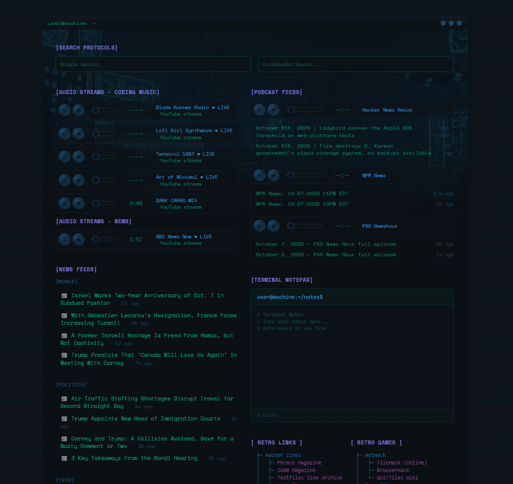

# Startpage Console



A startpage for your browser.

## Features

- Terminal-style startpage interface with retro aesthetics
- Audio streams integration (YouTube-based coding music & news streams)
- Podcast feed support with play/pause/stop controls
- Terminal notepad with auto-save and character count
- News feeds display with background refresh and caching
- Multiple proxy fallback for reliable RSS fetching
- Quick-access link grid with categorized sections
- System info/status bar (uptime, CPU, RAM, network)

## Installation

1. Clone the repository:

```bash
git clone https://github.com/yourusername/minimal-startpage.git
